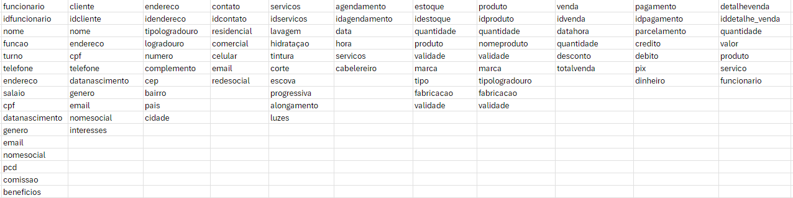
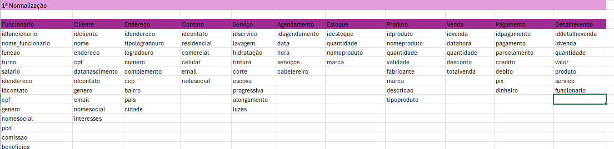
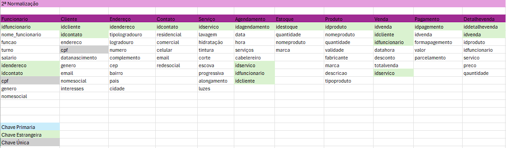
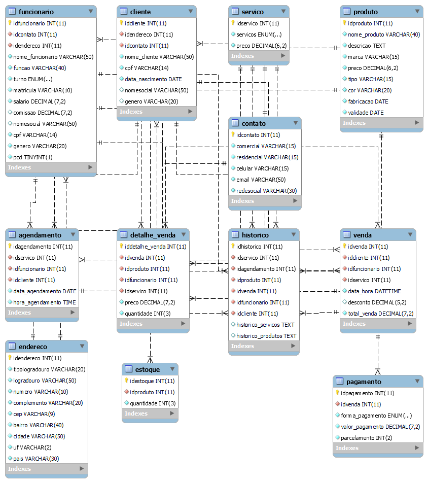

# Cabelos incríveis
# Estudo de Caso: Salão de Cabeleireiro "Cabelos Incríveis"

### Cabelos Incríveis 

## Contexto:
O salão de cabeleireiro "Cabelos Incríveis" é um estabelecimento localizado em uma área movimentada da cidade. O salão oferece uma variedade de serviços, incluindo cortes de cabelo, coloração, tratamentos capilares, manicure e pedicure. Eles têm uma equipe de cabeleireiros talentosos e uma base de clientes fiéis.
### Desafio:
O salão de cabeleireiro "Cabelos Incríveis" está enfrentando dificuldades para gerenciar eficientemente seus clientes, agendamentos, estoque de produtos e informações dos funcionários. Eles precisam de um sistema de banco de dados para ajudar a organizar e automatizar esses processos. 
### Requisitos do Sistema:
• Gerenciamento de Clientes: Cadastro de novos clientes com informações como nome, endereço, telefone, e-mail, preferências de serviços, histórico de serviços realizados, etc. 
O registro de serviços realizados por cada cliente, incluindo datas, tipos de serviço, cabeleireiro responsável, etc.
O Possibilidade de atualização e exclusão de informações de clientes. 
### Agendamento de Serviços:
Capacidade de agendar serviços para clientes, incluindo data, horário, tipo de serviço, cabeleireiro responsável, etc. o Visualização rápida de disponibilidade de horários e cabeleireiros para agendamentos.   
### Gerenciamento de Estoque:
Controle de estoque de produtos utilizados no salão, como tinturas, shampoos, condicionadores, etc.
Registro de entrada e saída de produtos, incluindo quantidades e datas. 
### Informações dos Funcionários: 
Cadastro de informações dos funcionários, incluindo nome, função, horário de trabalho, salário, etc.
Atribuição de serviços realizados por cada funcionário e acompanhamento de seu desempenho.

# Modelo Lógico do Banco de Dados:
Modelação do banco de dados baseado nos requisidos exigidos acima, definindo um modelo lógico básico para o banco de dados do salão de cabeleireiro "Cabelos Incríveis".

# Especificação de elementos do banco de dados.

• Tabelas:
Clientes ▪ Cliente_ID (Chave Primária) ▪ Nome ▪ Endereço ▪ Telefone ▪ E-mail ▪ Preferências o Serviços ▪ Serviço_ID (Chave Primária) ▪ Tipo ▪ Descrição ▪ Preço o Agendamentos ▪ Agendamento_ID (Chave Primária) ▪ Cliente_ID (Chave Estrangeira referenciando a tabela Clientes) ▪ Serviço_ID (Chave Estrangeira referenciando a tabela Serviços) ▪ Data ▪ Horário ▪ Cabeleireiro o Estoque ▪ Produto_ID (Chave Primária) ▪ Nome ▪ Quantidade ▪ Data_Entrada ▪ Data_Saída o Funcionários ▪ Funcionário_ID (Chave Primária) ▪ Nome ▪ Função ▪ Horário_Trabalho ▪ Salário

# Modelo Lógico com as normalizações


## 1 Normalização



## 2 Normalização


## 3 Normalização

# Modelo Físico
### Código escrito em sql

```sql create database cabelosincriveisdb; use cabelosincriveis;

-- Criar banco de dados para o salão de cabelereiros "Cabelos Incríveis"

create database cabelosincriveisdb;
use cabelosincriveis;

CREATE TABLE endereco(
idendereco INT PRIMARY KEY AUTO_INCREMENT not null,
tipologradouro VARCHAR(20) not null,
logradouro VARCHAR(50)  not null,
numero VARCHAR(10)  not null,
complemento VARCHAR(20) not null,
cep VARCHAR(9) not null,
bairro VARCHAR(40) not null,
cidade VARCHAR(50) not null,
uf CHAR(2) not null,
pais VARCHAR(30) not null 
);

CREATE TABLE contato(
idcontato INT PRIMARY KEY AUTO_INCREMENT NOT NULL,
comercial VARCHAR(15) not null,
residencial VARCHAR(15) not null,
celular VARCHAR(15) NOT NULL DEFAULT 'not null',
email VARCHAR(50) not null,
redesocial VARCHAR(30) not null
);

CREATE TABLE servico(
idservico INT PRIMARY KEY AUTO_INCREMENT NOT NULL,
servicos ENUM ("corte","lavagem","hidratacao","coloracao","alisamento","alongamento","luzes","mechas","manicure","pedicure") not null,
preco DECIMAL(6,2) not null
);

CREATE TABLE produto(
idproduto INT PRIMARY KEY AUTO_INCREMENT NOT NULL,
nome_produto VARCHAR(40) not null,
descricao TEXT not null,
marca VARCHAR(15) not null,
preco DECIMAL(6,2)not null,
tipo VARCHAR(15)not null,
cor VARCHAR(20) not null,
fabricacao DATE not null,
validade DATE not null
);

CREATE TABLE funcionario(
idfuncionario INT PRIMARY KEY AUTO_INCREMENT NOT NULL,
idcontato int not null,
idendereco int not null,
nome_funcionario VARCHAR(50) not null,
funcao VARCHAR(40) not null,
turno ENUM ("Manhã","Tarde","Noite","Integral") not null,
matricula VARCHAR(10) not null unique,
salario DECIMAL(7,2) not null,
comissao DECIMAL(7,2),
nomesocial VARCHAR(50),
cpf VARCHAR(14) not null unique,
genero VARCHAR(20) not null
);

CREATE TABLE cliente(
idcliente INT PRIMARY KEY AUTO_INCREMENT NOT NULL,
idendereco int not null,
idcontato int not null,
nome_cliente VARCHAR(50) NOT NULL DEFAULT 'not null',
cpf VARCHAR(14) not null unique,
data_nascimento DATE not null,
nomesocial VARCHAR(50),
genero VARCHAR(20));

CREATE TABLE historico(
idhistorico INT PRIMARY KEY AUTO_INCREMENT NOT NULL,
idservico int not null,
idagendamento int not null,
idproduto int not null,
idvenda int not null,
idfuncionario int not null,
idclienteint int not null,
historico_servicos text,
historico_produtos text);

CREATE TABLE agendamento(
idagendamento INT PRIMARY KEY AUTO_INCREMENT NOT NULL,
idservico int not null,
idfuncionario int not null,
idcliente int not null,
data_agendamento DATE not null,
hora_agendamento TIME  not null
);

CREATE TABLE estoque(
idestoque INT PRIMARY KEY AUTO_INCREMENT NOT NULL,
idproduto int not null,
quantidade INT(3) not null
);

CREATE TABLE venda(
idvenda INT PRIMARY KEY AUTO_INCREMENT NOT NULL,
idclienteint int not null,
idfuncionario int not null,
idservico int not null,
data_hora DATETIME NOT NULL DEFAULT current_timestamp(),
desconto DECIMAL(5,2) default 0,
total_venda DECIMAL(7,2) not null
);

CREATE TABLE pagamento(
idpagamento INT PRIMARY KEY AUTO_INCREMENT NOT NULL,
idvenda int not null,
forma_pagamento ENUM ("Dinheiro","Débito","Pix","Crédito") not null,
valor_pagamento DECIMAL(7,2) not null,
parcelamento INT(2) not null default 1
);

CREATE TABLE detalhe_venda(
iddetalhe_venda INT PRIMARY KEY AUTO_INCREMENT NOT NULL,
idvenda int not null,
idproduto int not null,
idfuncionario int not null,
idservico int not null,
preco DECIMAL(7,2) not null,
quantidade INT(3) not null default 1
);

-- Criação de relacionamentos entre as tabelas

alter table funcionario
 add constraint funcionario_idcontato_contato_idcontato 
 foreign key (idcontato) 
 references contato(idcontato);
alter table funcionario 
add constraint funcionario_idendereco_endereco_idendereco 
foreign key (idendereco) 
references endereco(idendereco);
alter table cliente
add constraint cliente_idendereco_endereco_idendereco 
foreign key (idendereco) 
references endereco (idendereco);
alter table cliente 
add constraint cliente_idcontato_contato_idcontato 
foreign key (idcontato) 
references contato(idcontato);
alter table historico 
add constraint historico_idservico_servico_idservico 
foreign key (idservico) 
references servico(idservico);
alter table historico 
add constraint historico_idagendamento_agendamento_idagendamento 
foreign key (idagendamento) 
references agendamento(idagendamento);
alter table historico 
add constraint historico_idproduto_produto_idproduto 
foreign key (idproduto) 
references produto(idproduto);
alter table historico 
add constraint historico_idvenda_venda_idvenda
 foreign key (idvenda)
 references venda(idvenda);
alter table historico 
add constraint historico_idfuncionario_funcionario_idfuncionario
foreign key (idfuncionario) 
 references funcionario(idfuncionario);
alter table historico
 add constraint historico_idcliente_cliente_idcliente 
foreign key (idcliente)
 references cliente(idcliente);
alter table agendamento
add constraint agendamento_idservico_servico_idservico
foreign key (idservico)
references servico(idservico);
alter table agendamento 
add constraint agendamento_idfuncionario_funcionario_idfuncionario
foreign key (idfuncionario) 
 references funcionario(idfuncionario);
alter table agendamento
add constraint agendamento_idcliente_cliente_idcliente
foreign key (idcliente) 
references cliente(idcliente);
alter table estoque 
add constraint estoque_idproduto_produto_idproduto 
foreign key (idproduto)
references produto(idproduto);
alter table venda 
add constraint venda_idcliente_cliente_idcliente 
foreign key (idcliente) 
references cliente(idcliente);
alter table venda
add constraint venda_idfuncionario_funcionario_idfuncionario 
foreign key(idfuncionario) 
references funcionario(idfuncionario);
alter table venda 
add constraint venda_idservico_servico_idservico
foreign key (idservico)
 references servico(idservico);
alter table pagamento 
add constraint pagamento_idvenda_venda_idvenda 
foreign key (idvenda) 
references venda(idvenda);
alter table detalhe_venda 
add constraint detalhe_venda_idvenda_venda_idvenda 
foreign key (idvenda)
references venda(idvenda);
alter table detalhe_venda
add constraint detalhe_venda_idproduto_produto_idproduto
foreign key (idproduto)
references produto(idproduto);
alter table detalhe_venda 
add constraint detalhe_venda_idfuncionario_funcionario_idfuncionario 
foreign key (idfuncionario) 
references funcionario(idfuncionario);
alter table detalhe_venda
add constraint detalhe_venda_idservico_servico_idservico 
foreign key (idservico) 
references servico(idservico);
```

## Modelo de Entidade Relacional

#### Diagrama do relacionamento Casa Oliveira



